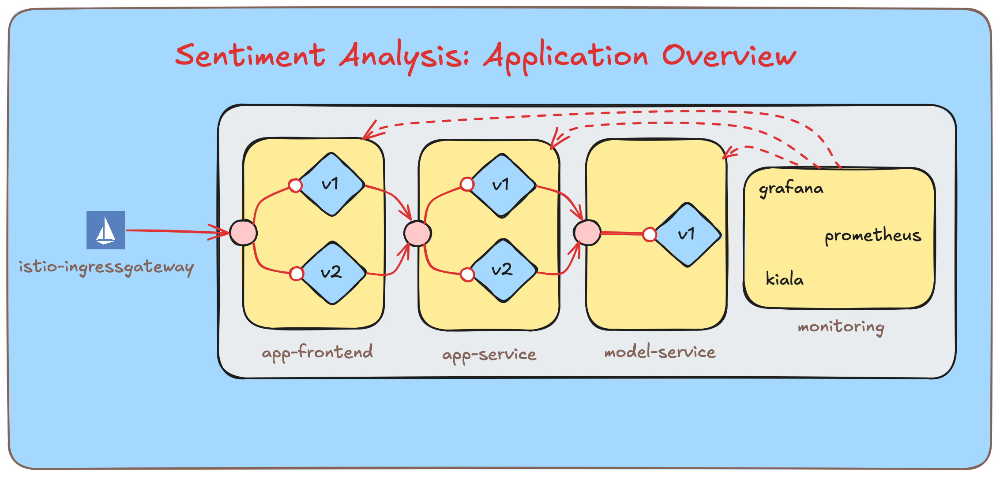
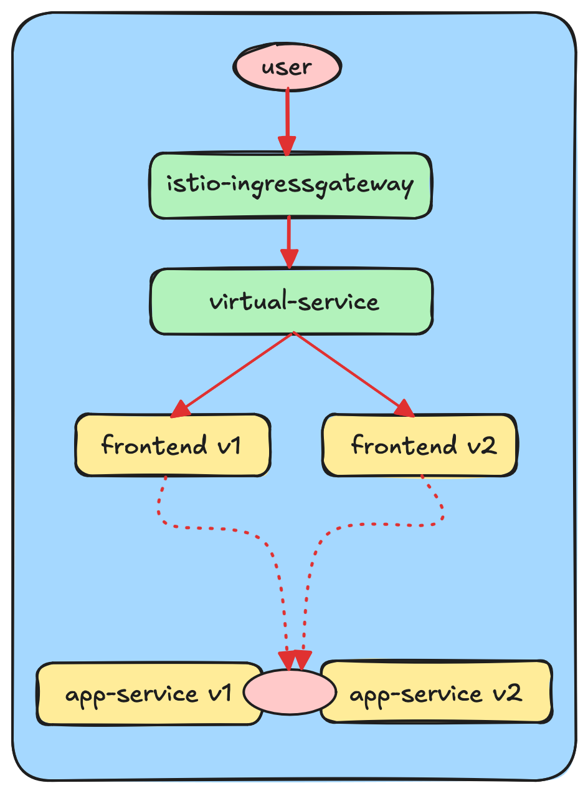
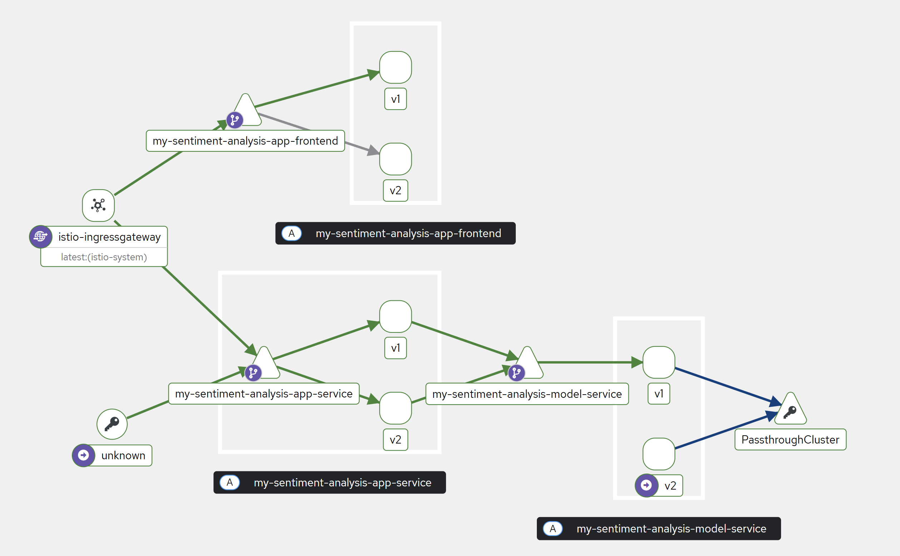

# Deployment Documentation   

## 1. Overall System Architecture

The application is deployed on a Kubernetes cluster and uses the Istio service mesh for advanced traffic management.  
The application is composed of three core components, in addition to the gateway. Each component is deployed with Istio sidecars that manage internal routing:

- **`istio-ingressgateway`**: Acts as the entry point into the system, managing all external traffic entering the Kubernetes cluster.
- **`app-frontend`**: Handles user interactions and communicates with the `app-service`. It has two active versions (`v1`, `v2`).
- **`app-service`**: Processes requests from the frontend and forwards them to the `model-service`. It also has two versions (`v1`, `v2`).
- **`model-service`**: Performs the core tasks and currently runs a single version (`v1`).

The application is monitored using Prometheus, Grafana, Kiali etc, each tracking or displaying different metrics.



## 2. Deployment Resources & Configuration

### 2.1 Kubernetes Resources
The following tables outline all essential Kubernetes resources that can be found under `helm/sentiment-analysis/templates`:

**Gateway Resources**
| File               | Type     | Description                                                                                          |
|--------------------|----------|------------------------------------------------------------------------------------------------------|
| ingress.yaml       | Ingress  | Configures HTTP routing with Helm templating, routing to app-frontend       |
| istio-ingress.yaml | Gateway  | Defines an Istio Gateway to manage external HTTP traffic entering the mesh via the ingress gateway   |


**Application Resources**
| File                             | Type                   | Description                                                                                          |
|----------------------------------|------------------------|------------------------------------------------------------------------------------------------------|
| app-frontend.yaml                | Deployment & Service   | Deploys a container hosting 2 different versions of the app-frontend separated via the image tag.   |
| appfrontend-destinationrule.yml | DestinationRule        | Provides 2 different versions of app-frontend                                                        |
| appfrontend-visualservice.yml   | VirtualService         | Handles direction of users to the different versions of app-frontend                                 |
| app-service.yaml                | Deployment & Service   | Deploys a container hosting 2 different versions of the app-service separated via the image tag.    |
| appservice-destinationrule.yml  | DestinationRule        | Provides 2 different versions of app-service                                                         |
| appservice-visualservice.yml    | VirtualService         | Routes users to different versions of app-service based on requests coming from app-frontend        |
| model-service.yaml              | Deployment & Service   | Deploys a container with 2 instances of model-service using the same image, treated as one version  |
| model-service-destinationrule.yml| DestinationRule        | Provides logical separation for model-service traffic (same image)          |
| model-service-visualservice.yml  | VirtualService         | Routes requests to the model-service instance      s             |

**Monitoring Resources**
| File                   | Type              | Description                                                                                                  |
|------------------------|-------------------|--------------------------------------------------------------------------------------------------------------|
| alertmanager-config.yaml | AlertmanagerConfig | Defines routing and receiver configuration for alerts & warnings            |
| prometheusrule.yaml     | PrometheusRule     | Specifies alerting rules      |
| servicemonitor.yaml     | ServiceMonitor     | Configures scraping of `/metrics` endpoint from app-service for Prometheus monitoring every 15 seconds       |

**Miscellaneous**
| File                          | Type        | Description                                                                                             |
|-------------------------------|-------------|---------------------------------------------------------------------------------------------------------|
| app-configmap.yaml            | ConfigMap   | Provides configuration data for the application     |
| grafana-dashboard-configmap.yaml | ConfigMap   | Contains dashboard definitions and Prometheus queries for Grafana visualizations                        |
| secret.yaml                   | Secret      | Stores sensitive data as key-value pairs using Kubernetes Secret                |

The following table outlines additional Istio monitoring resources located under `kubernetes/istio-addons`:
| File          | Description                                             |
|---------------|---------------------------------------------------------|
| jaegar.yaml   | Configures Jaeger for distributed tracing               |
| kiali.yaml    | Sets up Kiali for monitoring and managing Istio service mesh |
| prometheus.yaml | Deploys Prometheus for metrics collection and monitoring |

### 2.2 Kubernetes Monitoring Configuration

Monitoring is configured via the integration of the following tools:
- **Prometheus:**
    - Scrapes the `/metrics` endpoints of all services at 15 second intervals
    - Retrieves `total_requests`, `latency`, and `positive_predictions_ratio`
- **Grafana:**
    - Visualises the Prometheus metrics via dashboards
- **Kiali:**
    - Connects to Istio to monitor inter-service communication
    - Visualizes inter-service traffic flow and latency 
    - Updates it's graph every 15 seconds using Istio telemetry data
- **Jaegar:**
    - Collects and stores distributed traces across all services
    - Enables complete end-to-end request lifecycle tracking for debugging

### 2.3 Vagrant Deployment Configuration

The Vagrant deployment automates the setting up of Kubernetes with Istio. Using a multi-stage Ansible approach, it automatically spins up a complete, production-like cluster in a virtual environment. 

#### 2.3.1 Infrastructure Layout

The Vagrant environment provisions the following virtual machines:
- **Controller Node (`ctrl`):** Master node running at `192.168.56.100`
  - Hosts Kubernetes control plane components
  - Serves as the primary entry point for kubectl commands
- **Worker Node (`node`):** Worker nodes running at `192.168.56.101` & `192.168.56.102`
  - Execute application workloads and pods
  - Provide compute resources for the sentiment analysis application

#### 2.3.2 Deployment Pipeline

- **Base Setup** (`general.yml`: all nodes):
  - System tuning, SSH keys, Kubernetes prep
  - Installs containerd, kubelet/kubeadm/kubectl (v1.32.4)
- **Control Plane** (`ctrl.yml`: controller only):
  - `kubeadm init` with Flannel CNI (eth1, CIDR: 10.244.0.0/16)
  - Sets up `kubeconfig`, Helm
- **Worker Join** (`node.yml`: nodes):
  - Auto-joins workers to the cluster with token validation
- **Networking & Observability** (`finalization.yml`):
  - MetalLB (IP pool: `192.168.56.90-99`) + Nginx Ingress
  - Istio (v1.25.2), gateway IP (192.168.56.91)
  - Monitoring: Prometheus, Jaeger, Kiali + Kubernetes Dashboard

## 3. Data Flow & Runtime Architecture

The entrypoint of our application is its frontend. When a user types a review and submits it, the frontend is configured to send this request to a URL like `http://192.168.49.2/api/app-service/predict`. The hostname (`192.168.49.2` in this example) must resolve to the externally accessible IP address of the Istio Ingress Gateway. When running a local cluster using Minikube, this IP is provided by running the `minikube tunnel` command and using the `EXTERNAL-IP` assigned to the `istio-ingressgateway` service.

The Istio Ingress Gateway is the component responsible for receiving these incoming external requests where the routing logic defined in VirtualServices take over.  The external VirtualService  checks the request path and then routes the request to `app-service` and also performs URI rewriting (changing `/api/app-service/predict` to `/predict`) before forwarding the request.

The internal VirtualService for `app-service` will then check the `app-version` header and perform one of the following actions:
- If `app-version: "v1"` is present, the request is routed to `subset: v1` of the `app-service`.
- If `app-version: "v2"` is present, the request is routed to `subset: v2` of the `app-service`.
- If the header is missing or doesn't match, the request defaults to `subset: v1` of the `app-service`.

The request is finally handled by an actual pod of the selected `app-service` version.

The above discussed Istio configuration and routing logic can be visualized in the diagram below:


Upon receiving the request, `app-service` will: 
- Increment the request count for A/B testing metrics.
- Forwards the input data to an external `MODEL_SERVICE_URL` to get a sentiment prediction.

`model-service` receives this request and:
- preprocesses the incoming reveiew using a pre-loaded vectorizer from `model-training` GitHub Release using a function loaded from `lib-ml`.
- feeds these features to a pre-loaded machine learning model (also pulled from `model-training` GitHub Release) using a `lib-ml` function and gets the prediction
- Return this output as a numerical representation (0 means negative, 1 means positive).

`app-service` will then perform the following actions based on the output by `model-serivce`:
- Updates Prometheus metrics for total predictions (by sentiment), the ratio of positive sentiments, and prediction latency. These metrics are made available through `/metrics` endpoint and this endpoint is configured to be hit every 15 seconds by Prometheus. 
- Returns the prediction result (or an error) from the model service back to the client.


## 4. Dynamic Routing & Canary Releases

Our system leverages Istio service mesh to implement sophisticated dynamic routing and canary release strategies through [VirtualService](https://istio.io/latest/docs/reference/config/networking/virtual-service/) and [DestinationRule](https://istio.io/latest/docs/reference/config/networking/destination-rule/) resources. This configuration enables us to dynamically control traffic distribution between multiple service versions without modifying service definitions or restarting deployments.

Dynamic routing is implemented across two core components in our deployment:

- **`app-frontend`** - Frontend service maintaining two concurrent versions:
  - `app-frontend:v1` - baseline version with original UI design
  - `app-frontend:v2` - experimental version with modified color scheme (background and buttons)

- **`app-service`** - Application service also maintaining dual versions:
  - `app-service:v1` - baseline version  
  - `app-service:v2` - enhanced version with additional metrics collection

Each version is distinguished through Kubernetes labels (`version: v1` and `version: v2`), with DestinationRules leveraging these labels to define corresponding traffic subsets.



Our system operates in two distinct routing modes depending on the operational context:

1. **Production Mode (90/10 split)**: Standard canary release pattern where 90% of users experience the stable v1 version and 10% are exposed to the experimental v2 version

2. **Experimentation Mode (50/50 split)**: A/B testing configuration that provides equal traffic distribution to ensure statistical significance in comparing user behavior between versions

**Sticky Session Routing**

The system employs sticky session routing based on the `user` header to ensure consistent user experience:

- Users are deterministically assigned to either v1 or v2 based on their identifier
- Once assigned, users remain on the same version throughout their session
- This approach eliminates version-switching confusion and provides reliable experimental data

*For detailed configuration, see [app-frontend VirtualService](kubernetes/helm/sentiment-analysis/templates/appfrontend-virtualservice.yml) and [DestinationRule](kubernetes/helm/sentiment-analysis/templates/appfrontend-destinationrule.yml) in the repository.*

**Routing Logic Flow:**

```
Incoming Request
       │
       ▼
┌─────────────────┐
│ Check Headers   │
│ app-version: ?  │
└─────────────────┘
       │
       ├─── "v1" ────► App-Service v1
       │
       ├─── "v2" ────► App-Service v2
       │
       └─── missing ──► App-Service v1 (default)
```

This approach ensures that frontend and backend versions remain synchronized, maintaining consistency in both user experience and metrics collection.

*See [app-service VirtualService configuration](kubernetes/helm/sentiment-analysis/templates/appservice-virtualservice.yml) for implementation details.*