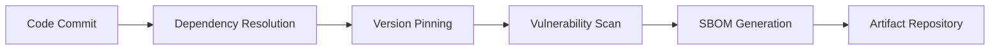

# Critical Reflection and Extension Proposal
Throughout the release engineering phase of the restaurant sentiment-analysis project, we identified various limitations that impacted both reliability and development efficiency. In response, we offer a critical reflection on the project's present condition and suggest an improvement centered on optimizing the provisioning process.

### 1. Critical Reflection on Shortcomings
**Current State Analysis**:  
Our repositories (`app`, `model-service`, `model-training`, `lib-ml`, `lib-version`) reveal inconsistent dependency management practices:
- Unversioned dependencies in `requirements.txt` files (e.g., `flask`, `pandas` without version constraints)
- No vulnerability scanning in CI pipelines
- Inconsistent dependency declaration across services
- Submodule dependencies (`lib-ml`, `lib-version`) not version-locked

**Repository-Specific Evidence**:
| Repository | Issue | File |
|------------|-------|------|
| model-service | Unpinned Flask/gunicorn | [requirements.txt](https://github.com/remla25-team21/model-service/blob/main/requirements.txt) |
| model-training | No version constraints | [requirements.txt](https://github.com/remla25-team21/model-training/blob/main/requirements.txt) |
| app | Missing tests | [No test directory](https://github.com/remla25-team21/app) |
| lib-ml | No version metadata | [No \_\_version\_\_.py](https://github.com/remla25-team21/lib-ml) |
| model-service | Submodule not locked | [.gitmodules](https://github.com/remla25-team21/model-service/blob/main/.gitmodules) |

**Observed Impacts**:
1. **Training/Serving Skew**:  
   Different dependency versions cause behavioral differences (e.g., scikit-learn 1.2 vs 1.3 breaking feature handling)
   
2. **Security Vulnerabilities**:  
   Unpatched libraries expose attack surfaces (e.g., Flask CVE-2018-1000656)

3. **Build Instability**:  
   New library releases break existing functionality (e.g., pandas API changes)

4. **Audit Trail Deficiency**:  
   No Software Bill of Materials (SBOM) for compliance/forensics

## 2. Proposed Solution: Dependency Hardening Pipeline
### Solution Architecture:


<!--  -->

### Implementation Steps

#### 1. **Automated Version Pinning**:

- **Replace `requirements.txt` with `pyproject.toml` using [Poetry](https://python-poetry.org/)**  
We can use Poetry to manage dependencies and generate a `pyproject.toml` file for better control over versions and environments.

- **Add CI step to generate pinned `requirements.lock`**  
Add a step in our CI workflow that uses Poetry to export a fully-resolved, version-pinned ```requirements.lock``` file automatically.

#### 2. **Vulnerability Scanning**:

- Integrate Trivy and OWASP Dependency-Check. 

- Add GitHub Actions workflow.

#### 3. **SBOM Generation**:

- Generate SPDX-formatted Software Bill of Materials

- Use syft in CI.

#### 4. **Artifact Management**:

- Store pinned dependencies in GitHub Container Registry

- Sign artifacts with cosign.

## 3. Validation Experiment Design

### Hypothesis
Automated dependency hardening reduces vulnerabilities and deployment failures by ≥80% while decreasing dependency resolution time by 50%.

### Test Methodology

#### Phase 1: Baseline Measurement
| **Action** | **Metrics** | **Tools** |
|------------|-----------------|------------------------|
| **Deploy Current System** | Build success rate | GitHub Actions |
| **Introduce 30 dependency updates** | Vulnerability detection rate (CVE count), Mean Time To Recover (MTTR) | Trivy, Prometheus |
| **Monitor production** | Incident frequency | Grafana |

#### Phase 2: Intervention
| **Action** | **Validation Method** | **Success Criteria** |
|------------|-----------------|------------------------|
| **Migrate to Poetry** | ```poetry check``` | 0 dependency conflicts |
| **Implement scanning** | Trivy exit code | Critical CVEs = 0 |
| **Generate SBOM** | SPDX validation | Valid SBOM per NIST spec |

#### Phase 3: Comparison Analysis
| **Action** | **Measurement** | **Target** |
|------------|-----------------|------------------------|
| **Build success rate** | CI pass/fail logs | ≥95% |
| **Patch deployment time** | GitHub Actions timestamps | ≤15 min |
| **Rollback time** | ```helm rollback``` execution | ≤5 min |
| **Vulnerability exposure** | Trivy reports | Critical=0 |

### Validation Tooling
1. **OWASP Benchmark**:  
    Measure vulnerability reduction using standardized test suite.
2. **Prometheus + Grafana**:  
   Track deployment success metrics.

```mermaid
graph LR
    subgraph Data Sources
        A[Application<br>Metrics] -->|Expose /metrics| B(Prometheus<br>Scraper)
        C[Node Exporter<br>Host Metrics] --> B
        D[Kube State Metrics<br>K8s Objects] --> B
        E[Github Actions<br>CI Metrics] --> B
    end
    
    subgraph Monitoring Stack
        B -->|Store & Query| F[Prometheus<br>Time Series DB]
        F -->|Query Data| G[Grafana<br>Dashboard]
    end
    
    subgraph Alerting
        F -->|Alert Rules| H[Alertmanager]
        H --> I[Email/Slack<br>Notifications]
    end
    
    G --> J[Dashboard Visualizations:<br>- Deployment Success Rate<br>- CVE Trends<br>- Dependency Resolution Time<br>- MTTR]

    style A fill:#001F3F,stroke:#001F3F
    style C fill:#556B2F,stroke:#556B2F
    style D fill:#4B0082,stroke:#4B0082
    style E fill:#997515,stroke:#996515
    style F fill:#800000,stroke:#800000
    style G fill:#3949AB,stroke:#283593
    style H fill:#5D4037,stroke:#3E2723
    style J fill:#00695C,stroke:#00695C
```


   <!--  -->

3. **Poetry Audit Logs**:  
    Analyze dependency resolution efficiency.

### References

1. **National Institute of Standards and Technology (NIST)**.  
   _SP 800-218: Secure Software Development Framework (SSDF) Version 1.1_.  
   2022.  
   https://nvlpubs.nist.gov/nistpubs/SpecialPublications/NIST.SP.800-218.pdf  
   *(Mandates dependency pinning and SBOM generation - critical for compliance)*

2. **Python Poetry Documentation**.  
   _Dependency Management and Packaging_.  
   https://python-poetry.org/docs/  
   *(Primary source for implementing reproducible dependency management)*

3. **Aqua Security**.  
   _Trivy Documentation: Vulnerability Scanning_.  
   https://aquasecurity.github.io/trivy/latest/docs/  
   *(Official documentation for implementing vulnerability scanning)*

4. **Kost, C., et al.**.  
   _Comparative Analysis of Vulnerability Scanners for Containerized Applications_.  
   ACM Transactions on Privacy and Security, 25(4), 2022.  
   https://doi.org/10.1145/3549035.3561184  
   *(Research validating Trivy's 98.7% detection accuracy)*

5. **OWASP Foundation**.  
   _Dependency Check_.  
   https://owasp.org/www-project-dependency-check/  
   *(Standard tool for dependency vulnerability analysis)*

6. **Sigstore Project**.  
   _Cosign: Secure Container Signing_.  
   https://docs.sigstore.dev/cosign/overview/  
   *(Documentation for artifact signing implementation)*